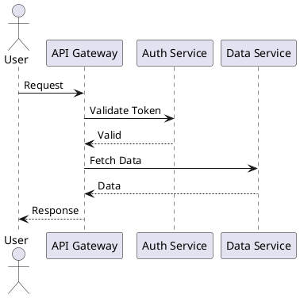
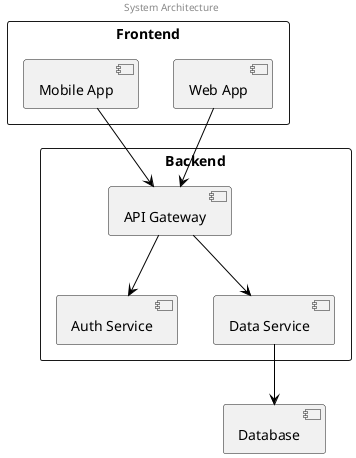
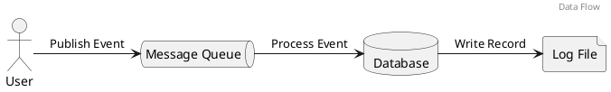
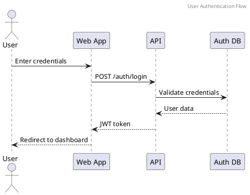
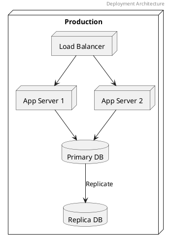

# Creating Diagrams

When and how to use diagrams effectively.

## Purpose

Diagrams help when:
- Explaining complex relationships
- Showing system architecture
- Illustrating data flows
- Documenting deployment topologies
- Onboarding new developers

## When to Use Diagrams

### ✅ Use Diagrams For:

- System architecture (high-level overview)
- Data flow through components
- Sequence of operations
- Network topology
- Deployment architecture

### ❌ Don't Use For:

- Simple linear processes (text is clearer)
- Implementation details (code comments are better)
- Temporary workarounds (fix the code instead)
- Obsolete architectures (update the diagram)

## Diagram Tools

### draw.io

**Best for:** Architecture diagrams, deployment diagrams, component diagrams

**Advantages:**
- Free and web-based
- Export to multiple formats (PNG, SVG, PDF)
- Version control friendly
- Large library of shapes

**Workflow:**
1. Go to [diagrams.net](https://diagrams.net)
2. Create diagram
3. File → Export as → PNG
4. Save both .drawio source and PNG to your repo

### PlantUML

**Best for:** Sequence diagrams, data flow diagrams, structural diagrams

**Advantages:**
- Text-based (Git friendly)
- Auto-layout
- Consistent styling
- Quick to iterate

**Workflow:**
1. Write PlantUML code
2. Generate PNG: `plantuml file.puml`
3. Commit both .puml and PNG

**Example:**


## Diagram Standards

### File Naming

Use kebab-case matching the diagram subject:
```
images/
├── system-overview.png
├── data-flow.png
├── deployment-architecture.png
└── api-sequence.png
```

### File Format

| Format | Use |
|--------|-----|
| **PNG** | Documentation (max width: 800px) |
| **drawio** | Source for draw.io diagrams |
| **puml** | Source for PlantUML diagrams |

**Always commit source files alongside PNGs.**

### Image Size

- **Max width:** 800px for documentation
- **DPI:** 72 or 96 (screen resolution)
- **Theme:** Light theme (works with most doc themes)

### Markdown Syntax

```markdown

```

## Diagram Types

### System Architecture Diagram

Shows major components and their relationships.



### Data Flow Diagram

Shows how data moves through the system.



### Sequence Diagram

Shows the sequence of operations between components.



### Deployment Diagram

Shows deployment topology.



## Best Practices

### ✅ Good Diagram Practices

1. **One idea per diagram**
   - Don't overcrowd
   - Use multiple diagrams if needed

2. **Consistent styling**
   - Same shape = same type of component
   - Consistent colors and labels

3. **Clear labels**
   - Label every component
   - Label relationships (arrows)
   - Include a legend if needed

4. **Appropriate detail level**
   - High-level: Major components only
   - Low-level: Single flow or component

### ❌ Common Mistakes

```markdown
# Bad: Too much information
[Diagram showing every single function call and data field]

# Good: Focused on key concepts
[High-level architecture diagram]
[Separate diagram for specific flow]
```

## Example: Documenting with Diagrams

```markdown
## System Architecture

The system consists of three main layers:


### Components

- **API Gateway:** Routes and validates requests
- **Services:** Business logic microservices
- **Database Layer:** Persistent storage

## Request Flow


1. Client sends request to API Gateway
2. Gateway validates authentication
3. Request routed to appropriate service
4. Service queries database
5. Response returned via Gateway
```

## See Also

- [Architecture Documentation](03-architecture.md) - Documenting system design
- [Diagram Sources](../resources/diagram-sources/) - Reusable diagram templates
